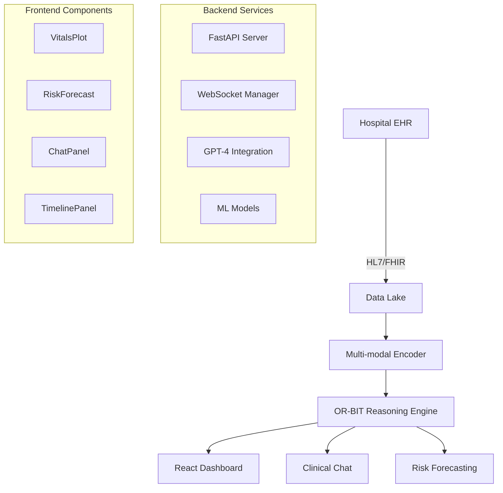

# OR-BIT: Operating Room Bio-Intelligence Twin

🚀 **A complete clinical AI system with real-time vitals monitoring, GPT-4-turbo clinical reasoning, and predictive risk analytics.**


## 🌟 Features

### 🩺 Clinical Intelligence
- **Real-time vitals monitoring** (MAP, HR, SpO₂, RR, Temperature, EtCO₂, BIS)
- **GPT-4-turbo powered clinical chat** with context-aware reasoning
- **Predictive risk forecasting** with 30-minute trajectory analysis
- **SHAP-based explainable AI** for clinical decision support
- **Real-time alert system** with customizable thresholds

### 📊 Advanced Analytics
- **Multi-modal data fusion** (time-series + clinical text)
- **RAG-enhanced clinical knowledge** base integration
- **Conformal prediction** for uncertainty quantification
- **Interactive data visualization** with Chart.js
- **Export capabilities** for clinical documentation

### 🔧 Technical Excellence
- **WebSocket real-time streaming** for live data updates
- **Next.js + React frontend** with Tailwind CSS
- **FastAPI Python backend** with async processing
- **TypeScript** for type-safe development
- **Docker containerization** for easy deployment

## 🏗️ Architecture



## 🚀 Quick Start

### Prerequisites

- **Node.js** ≥ 18.0.0
- **Python** ≥ 3.11
- **OpenAI API Key** (for GPT-4-turbo)
- **Git**

### 1. Clone the Repository

```bash
git clone https://github.com/your-username/orbit-clinical-ai.git
cd orbit-clinical-ai
```

### 2. Backend Setup

```bash
# Navigate to backend directory
cd backend

# Create virtual environment
python -m venv venv
source venv/bin/activate  # Windows: venv\Scripts\activate

# Install dependencies
pip install -r requirements.txt

# Create environment file
cp .env.example .env

# Edit .env with your OpenAI API key
nano .env  # Add: OPENAI_API_KEY=sk-your-key-here
```

### 3. Frontend Setup

```bash
# Navigate to frontend directory (new terminal)
cd frontend

# Install dependencies
npm install

# Create environment file
cp .env.local.example .env.local
```

### 4. Start the Application

**Terminal 1 - Backend:**
```bash
cd backend
source venv/bin/activate
uvicorn main:app --reload --port 8000
```

**Terminal 2 - Frontend:**
```bash
cd frontend
npm run dev
```

### 5. Access OR-BIT

🌐 **Open your browser to:** `http://localhost:3000`

✅ **Verify backend is running:** `http://localhost:8000/health`

## 📁 Project Structure

```
orbit-clinical-ai/
├── 📁 backend/
│   ├── main.py                 # FastAPI application
│   ├── models/                 # ML models and data classes
│   ├── rag/                   # RAG implementation
│   ├── requirements.txt       # Python dependencies
│   └── .env.example          # Environment template
├── 📁 frontend/
│   ├── src/
│   │   ├── pages/
│   │   │   └── index.tsx      # Main dashboard
│   │   └── components/
│   │       ├── VitalsPlot.tsx # Real-time vitals chart
│   │       ├── RiskForecast.tsx # Predictive analytics
│   │       ├── ChatPanel.tsx  # AI chat interface
│   │       ├── TimelinePanel.tsx # Event timeline
│   │       ├── PatientSummary.tsx # Patient overview
│   │       └── AlertsPanel.tsx # Alert management
│   ├── package.json          # Node.js dependencies
│   ├── next.config.js        # Next.js configuration
│   └── tailwind.config.js    # Tailwind CSS config
├── 📁 data/
│   └── sample_mimic_stream.json # Synthetic patient data
├── docker-compose.yml        # Docker orchestration
├── Makefile                 # Development commands
└── README.md               # This file
```

## 🔧 Configuration

### Environment Variables

**Backend (.env):**
```env
# Required
OPENAI_API_KEY=sk-your-openai-api-key-here

# Optional
FASTAPI_HOST=0.0.0.0
FASTAPI_PORT=8000
LOG_LEVEL=INFO
CORS_ORIGINS=http://localhost:3000
```

**Frontend (.env.local):**
```env
NEXT_PUBLIC_API_BASE=http://localhost:8000
```

### Clinical Alert Rules

Customize alert thresholds in the dashboard:
- **Hypotension:** MAP < 65 mmHg
- **Severe Hypotension:** MAP < 55 mmHg
- **Tachycardia:** HR > 100 bpm
- **Hypoxemia:** SpO₂ < 95%

## 🐳 Docker Deployment

### Development
```bash
# Start all services
docker-compose up --build

# View logs
docker-compose logs -f
```

### Production
```bash
# Production deployment
docker-compose -f docker-compose.prod.yml up -d --build

# Scale services
docker-compose up --scale orbit-backend=3
```

## 📊 API Endpoints

### Real-time Data
- `GET /vitals` - Recent vitals data
- `GET /events` - Clinical events timeline
- `WS /ws` - WebSocket for real-time streaming

### AI Services
- `POST /ask` - Clinical AI chat
- `POST /forecast` - Risk prediction
- `GET /patient-summary` - Patient overview

### System
- `GET /health` - Health check
- `GET /admin/stats` - System statistics
- `POST /admin/reset` - Reset simulation

## 🧪 Development

### Running Tests
```bash
# Backend tests
cd backend && python -m pytest

# Frontend tests
cd frontend && npm test
```

### Code Quality
```bash
# Format code
make format

# Run linting
make lint

# Type checking
cd frontend && npm run type-check
```

### Adding New Features

1. **New Vital Sign:**
   - Update `VitalSigns` dataclass in `backend/main.py`
   - Add to `VITAL_CONFIGS` in `VitalsPlot.tsx`

2. **New Alert Type:**
   - Extend `generate_clinical_events()` function
   - Update alert rules in `AlertsPanel.tsx`

3. **New AI Capability:**
   - Enhance system prompt in `/ask` endpoint
   - Add new quick questions to `ChatPanel.tsx`

## 🔍 Monitoring & Observability

### Health Checks
```bash
# Check all services
curl http://localhost:8000/health
curl http://localhost:3000/api/health

# System metrics
curl http://localhost:8000/admin/stats
```

### Logging
- **Backend:** Structured JSON logs with different levels
- **Frontend:** Browser console + error boundaries
- **Production:** Integration with Sentry for error tracking

## 🚀 Deployment Options

### Cloud Platforms

**Vercel (Frontend) + Render (Backend):**
```bash
# Deploy frontend to Vercel
cd frontend && vercel --prod

# Deploy backend to Render
# (Connect GitHub repo in Render dashboard)
```

**AWS ECS:**
```bash
# Build and push Docker images
docker build -t orbit-backend backend/
docker build -t orbit-frontend frontend/

# Deploy with terraform (infrastructure as code)
cd infrastructure && terraform apply
```

**Google Cloud Run:**
```bash
# Deploy backend
gcloud run deploy orbit-backend --source backend/ --platform managed

# Deploy frontend
gcloud run deploy orbit-frontend --source frontend/ --platform managed
```

## 🔐 Security Considerations

### Production Checklist
- [ ] Change default secret keys
- [ ] Enable HTTPS/TLS
- [ ] Configure CORS properly
- [ ] Set up authentication (OAuth/SAML)
- [ ] Implement rate limiting
- [ ] Enable audit logging
- [ ] Secure API keys in vault
- [ ] Configure network security groups

### HIPAA Compliance
- [ ] Data encryption at rest and in transit
- [ ] Access control and audit trails
- [ ] De-identification of patient data
- [ ] Business associate agreements
- [ ] Regular security assessments

## 🤝 Contributing

1. **Fork the repository**
2. **Create feature branch:** `git checkout -b feature/amazing-feature`
3. **Commit changes:** `git commit -m 'Add amazing feature'`
4. **Push to branch:** `git push origin feature/amazing-feature`
5. **Open a Pull Request**

### Development Guidelines
- Follow TypeScript/Python type hints
- Write tests for new features
- Update documentation
- Follow conventional commit messages
- Ensure all checks pass

## 📚 Clinical Background

### Evidence Base
- **Hypotension Management:** Maintain MAP >65 mmHg for organ perfusion
- **Risk Stratification:** Early warning systems reduce adverse events
- **Clinical Decision Support:** AI augmentation improves diagnostic accuracy
- **Real-time Monitoring:** Continuous assessment enables proactive care

### Model Training Data
- **MIMIC-IV:** ICU database for model validation
- **Synthetic Data:** Privacy-preserving simulation for development
- **Feature Engineering:** Clinical expert knowledge integration

## 🆘 Troubleshooting

### Common Issues

**Backend won't start:**
```bash
# Check Python version
python --version  # Should be ≥3.11

# Verify dependencies
pip install -r requirements.txt

# Check OpenAI API key
echo $OPENAI_API_KEY
```

**Frontend build errors:**
```bash
# Clear cache
rm -rf .next node_modules
npm install

# Check Node version
node --version  # Should be ≥18.0
```

**WebSocket connection fails:**
```bash
# Check CORS configuration
# Verify backend is running on port 8000
# Test WebSocket endpoint directly
```

**Charts not displaying:**
```bash
# Verify Chart.js installation
npm list react-chartjs-2

# Check browser console for errors
# Ensure data format matches component props
```

### Getting Help

- 📧 **Email:** support@orbit-clinical.ai
- 💬 **Discord:** [OR-BIT Community](https://discord.gg/orbit-clinical)
- 📖 **Documentation:** [docs.orbit-clinical.ai](https://docs.orbit-clinical.ai)
- 🐛 **Issues:** [GitHub Issues](https://github.com/your-username/orbit-clinical-ai/issues)

## 📄 License

This project is licensed under the MIT License - see the [LICENSE](LICENSE) file for details.

## 🙏 Acknowledgments

- **MIMIC-IV** database team for clinical data standards
- **OpenAI** for GPT-4-turbo API
- **Anthropic** for Claude development assistance
- **Clinical advisors** for domain expertise
- **Open source community** for foundational tools

---

**Built with ❤️ for advancing clinical care through AI**

*OR-BIT v1.0.0 - Operating Room Bio-Intelligence Twin*